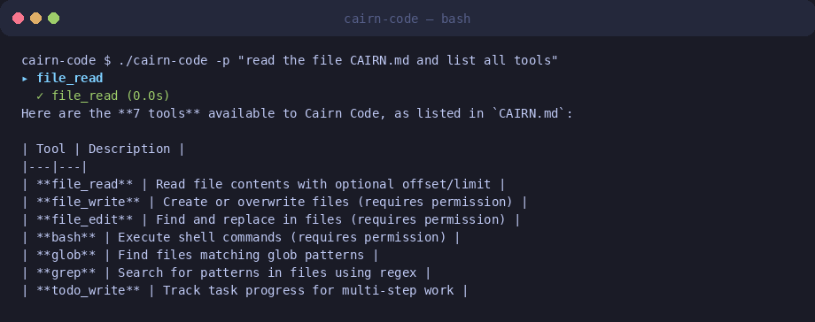
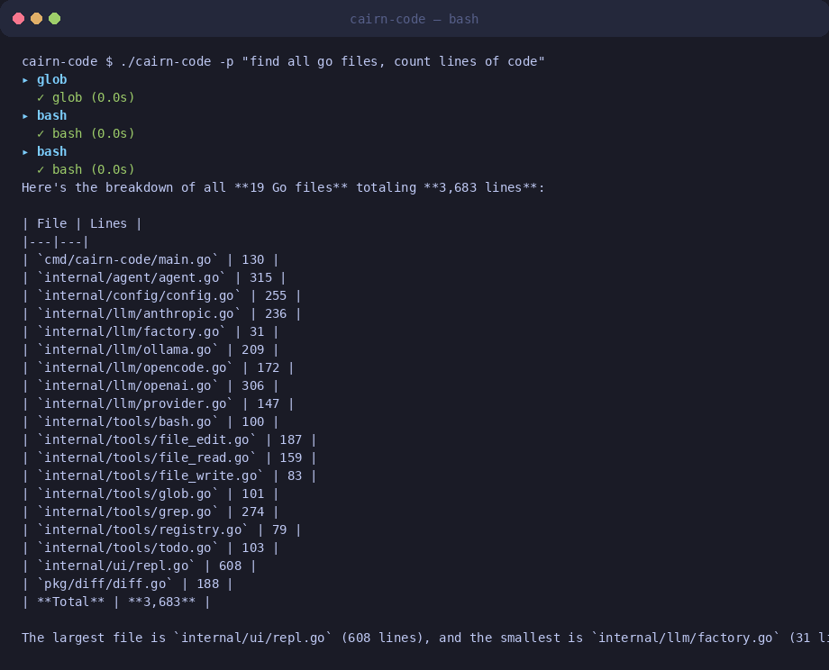
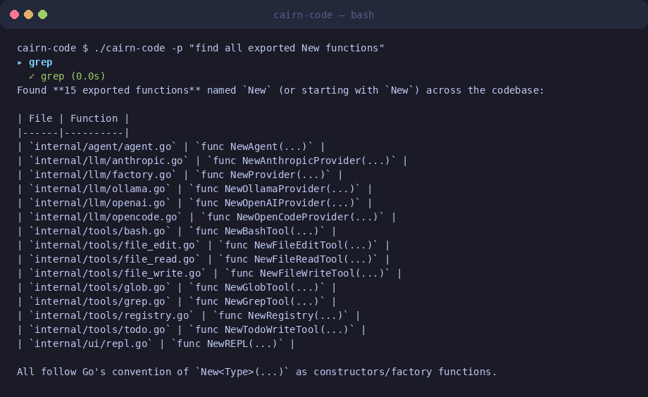

<p align="center">
  
  
  
  
  
  
</p>

<h1 align="center">Cairn Code</h1>

<p align="center">
  <strong>A Go-based CLI LLM coding agent, inspired by Claude Code.</strong><br>
  <i>Built by Cairn</i>
</p>

## Screenshots

<p align="center">
  <br>
 <i>REPL startup with command reference</i>
</p>

<p align="center">
  <br>
 <i>Agent autonomously using Grep to search the codebase</i>
</p>

<p align="center">
  <br>
 <i>Non-interactive print mode for scripting and pipelines</i>
</p>

<p align="center">
  
  
  
  
</p>

## Features

- **Multi-provider LLM support** — Anthropic (Claude), OpenAI (GPT), Ollama (local models)
- **Agentic tool loop** — The LLM autonomously reads files, writes code, runs commands, and searches your codebase until the task is done
- **7 built-in tools** — FileRead, FileWrite, FileEdit, Bash, Glob, Grep, TodoWrite
- **Rich terminal REPL** — Bubbletea-powered TUI with markdown rendering, input history, and spinner animations
- **Permission system** — Per-tool allow/ask/deny configuration with pattern matching
- **Configurable** — Global (`~/.config/cairn-code/config.json`) and project-local (`.cairn/config.json`) settings
- **Print mode** — Non-interactive execution for scripting and pipelines

## Quick Start

### Install

```bash
go install ./cmd/...
```

### Configure

Set your API key:

```bash
export ANTHROPIC_API_KEY="sk-ant-..."
# or
export OPENAI_API_KEY="sk-..."
```

Optionally create a config file:

```json
// ~/.config/cairn-code/config.json
{
  "default_provider": "anthropic",
  "default_model": "claude-sonnet-4-20250514",
  "anthropic": {
    "api_key": "sk-ant-..."
  },
  "max_turns": 50,
  "permissions": {
    "auto_allow": ["FileRead", "Glob", "Grep"],
    "deny": ["Bash(rm -rf *)"]
  }
}
```

### Run

```bash
# Interactive REPL
./cairn-code

# One-shot prompt
./cairn-code "explain this codebase"

# Print mode (non-interactive)
./cairn-code -p "list all go files in this project"

# Override provider/model
./cairn-code --provider ollama --model llama3 "write a hello world"
```

## Architecture

```
cmd/cairn-code/main.go     Entry point, flag parsing, REPL launch
internal/
  agent/agent.go           Core agentic loop (LLM call → tool use → repeat)
  config/config.go         Configuration loading and merging
  llm/
    provider.go            Shared types (Message, ContentBlock, ToolDefinition)
    anthropic.go           Anthropic Messages API client
    openai.go             OpenAI Chat Completions client
    ollama.go             Ollama local model client
    factory.go            Provider factory
  tools/
    registry.go           Tool registry and discovery
    file_read.go          Read files with line pagination
    file_write.go         Create/overwrite files
    file_edit.go          Find-and-replace editing with diffs
    bash.go               Shell command execution with timeouts
    glob.go               File pattern matching (doublestar)
    grep.go               Regex search across codebase
    todo.go               Task tracking
  ui/repl.go              Bubbletea REPL with markdown rendering
pkg/
  diff/diff.go            LCS-based unified diff
```

### Agent Loop

```
User Prompt → Build System Prompt (CAIRN.md + Todos + Tools)
           → Call LLM with tools
           → Process Response:
             ├── Text → Display to user
             └── Tool Use → Check permissions → Execute → Append result → Loop
           → end_turn → Wait for next input
```

## Tools

| Tool | Description | Needs Permission |
|------|-------------|:---:|
| **FileRead** | Read files with line numbers, offset/limit pagination | No |
| **FileWrite** | Create or overwrite files | Yes |
| **FileEdit** | Find-and-replace editing with diff output | Yes |
| **Bash** | Execute shell commands with timeout | Yes |
| **Glob** | File pattern matching with doublestar | No |
| **Grep** | Regex search across the codebase | No |
| **TodoWrite** | Manage a task/todo list | No |

## REPL Commands

| Command | Description |
|---------|-------------|
| `/help` | Show available commands |
| `/clear` | Clear conversation history |
| `/model` | Show or change the current model |
| `/tools` | List available tools |
| `/cost` | Show token usage for the session |
| `/quit` | Exit Cairn Code |

## Configuration Reference

| Field | Type | Default | Description |
|-------|------|---------|-------------|
| `default_provider` | string | `"anthropic"` | LLM provider (`anthropic`, `openai`, `ollama`) |
| `default_model` | string | `"claude-sonnet-4-20250514"` | Default model identifier |
| `max_turns` | int | `100` | Maximum agent loop iterations |
| `max_tokens` | int | `8192` | Max tokens per LLM response |
| `system_prompt_file` | string | `"CAIRN.md"` | File to load as system prompt |
| `permissions.auto_allow` | []string | `[]` | Tools to auto-approve |
| `permissions.ask` | []string | `[]` | Tools that require confirmation |
| `permissions.deny` | []string | `[]` | Tools to block |

## License

Proprietary — © 2026 Cairn. All rights reserved. No license is granted. Do not reproduce, distribute, or use outside the Cairn organization without written permission.
